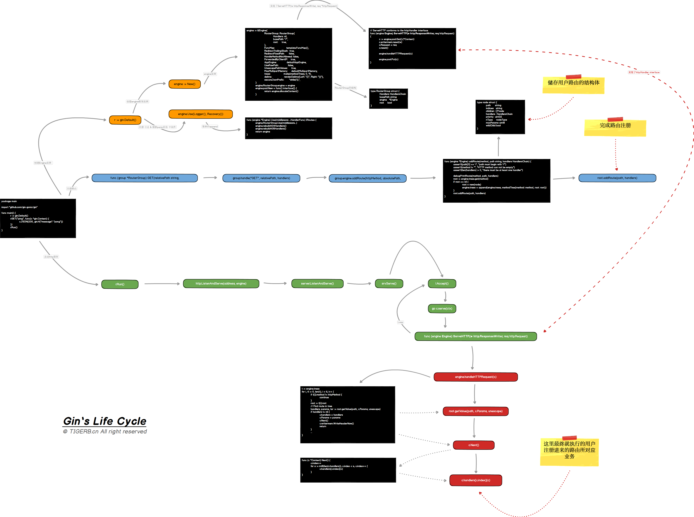

# GIN 使用记录文档
Gin is a web framework written in Go (Golang). It features a martini-like API with performance that is up to 40 times faster thanks to httprouter. If you need performance and good productivity, you will love Gin.

## 设计

### 信息链接
- [gin](https://gin-gonic.com/)
- [GIN框架分析](http://tigerb.cn/2019/07/06/go-gin/)