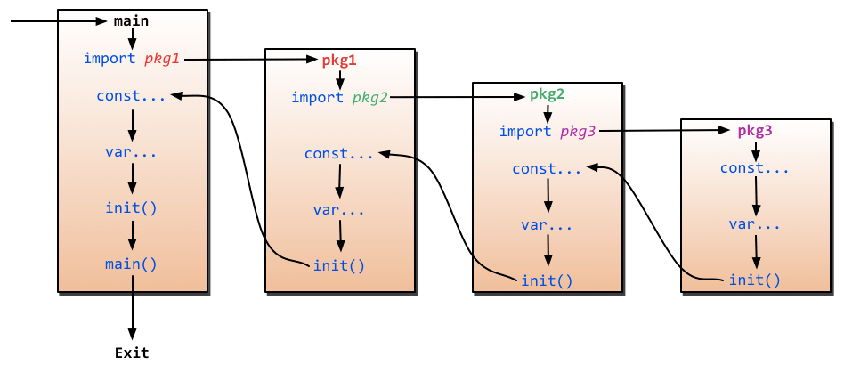

# Go 常见问题

## 基础问题

1. Golang 文件执行顺序

2. 如何理解 go 的 nil
3. 作用域范围

## web 项目搭建
- 分层结构
    1. ctrl
    2. svc
    3. orm
    4. model
- IOC/DI 相关性管理
- 配置管理
    1. 环境管理
- RPC

### 信息链接
- [Golang 常见面试题](http://wearygods.online/articles/2021/04/19/1618823886966.html)